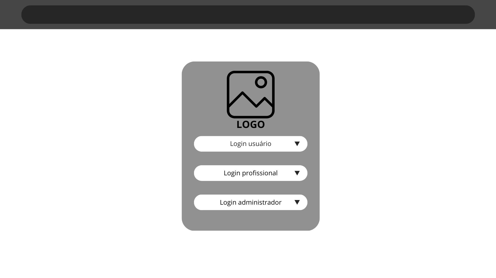
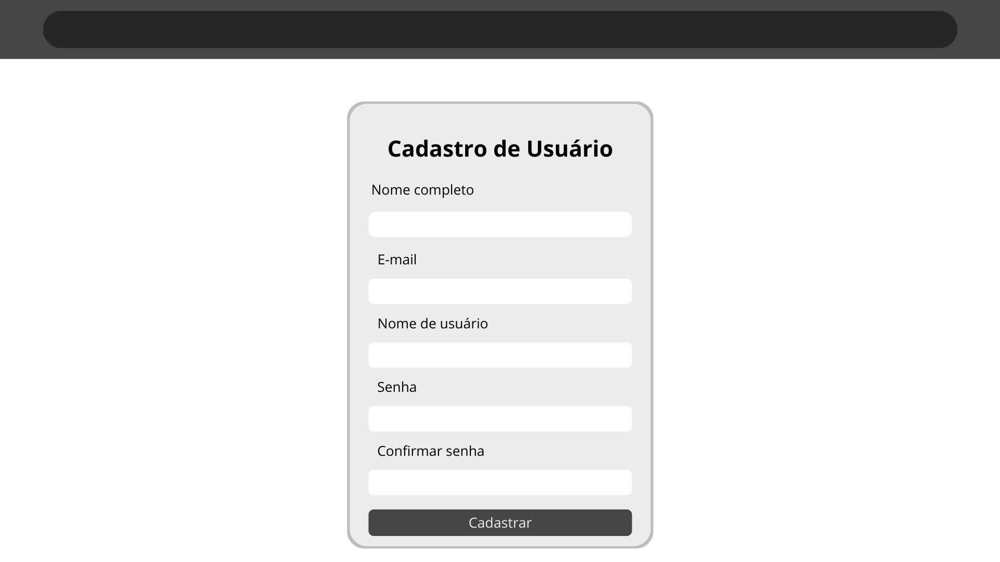
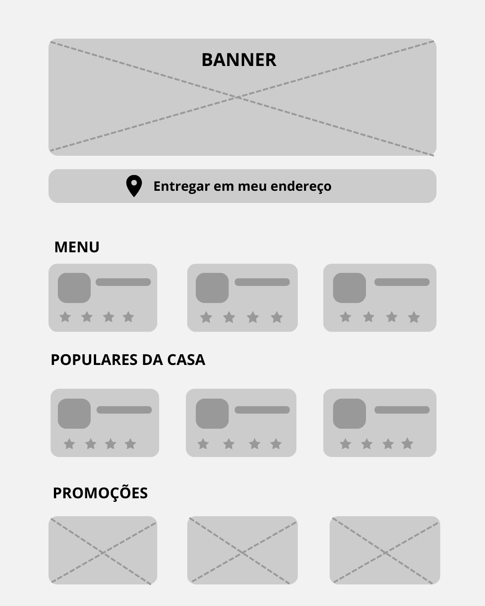
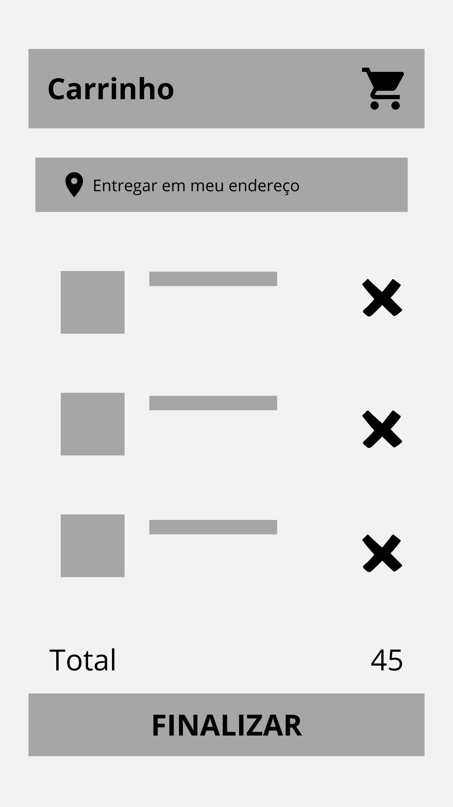
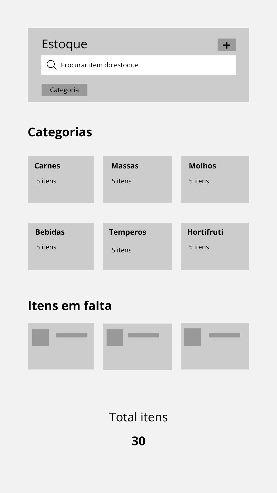

# 3. Projeto de Interface

**Pré-requisitos:** <a href="2-Especificação.md"> Documentação de Especificação</a>

Nesta seção, apresente as principais telas da plataforma e explique como a interface foi elaborada para atender aos requisitos funcionais, requisitos não funcionais e histórias de usuário definidos na Especificação do Projeto.

## 3.1 Wireframes

## Wireframes por Tela

### Tela 1 – Login

- Tela onde os usuários efetuam o login para utilizar o sistema, sejam eles profissionais, usuários comuns ou administradores.
- Login, segurança no login, usabilidade.  
- 

### Tela 2 – Cadastro de usuário

- Tela onde os usuários criam uma conta para utilizar o sistema, caso não tenham uma. 
- Cadastro de usuários, segurança, usabilidade. 
- 

### Tela 3 – Tela Inicial

- Tela de entrada do site, com banner promocional, botão de entrega e seções de navegação (menu, populares e promoções).
- Foco em destacar itens atrativos logo no início, facilitando acesso rápido ao cardápio e promoções. Feedback visual simples e direto.
-

### Tela 4 – Carrinho de Compras

- Exibe os itens adicionados pelo usuário, com opção de remover, visualizar total e finalizar o pedido.
- Layout simples e direto, botão de exclusão visível, total destacado e ação principal (FINALIZAR) em destaque. Recomenda-se feedback ao excluir item ou em caso de erro.
- 

### Tela 5 – Estoque 
-Tela de controle do estoque, com busca de itens, filtro por categoria e visualização de quantidades. Mostra também itens em falta.
-Interface limpa para busca rápida, categorias bem destacadas e contagem total exibida de forma clara para controle eficiente.
- 

 
> **Links Úteis**:
> - [Ferramentas de Wireframes](https://rockcontent.com/blog/wireframes/)
> - [MarvelApp](https://marvelapp.com/developers/documentation/tutorials/)
> - [Balsamiq](https://balsamiq.com/)

